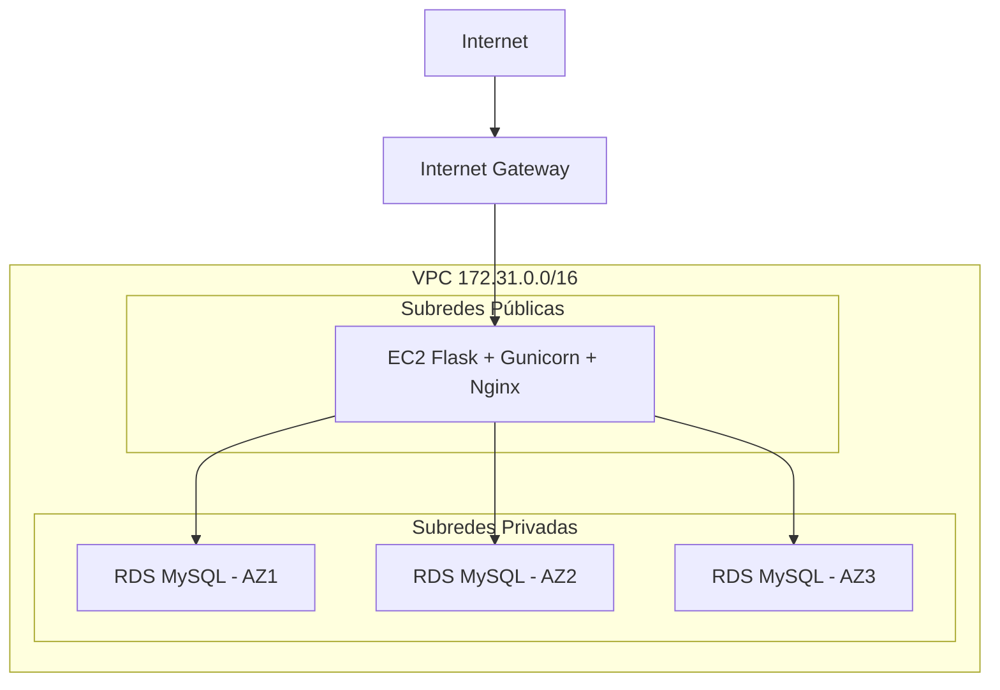

# 🚀 Laboratorio AWS: EC2 + RDS + Flask + Gunicorn + Nginx

Este proyecto es un laboratorio práctico para migrar un portal de acceso en **PHP** a una aplicación **Flask** en **AWS EC2**, conectada a una base de datos **RDS MySQL**, usando **Gunicorn** como servidor WSGI y **Nginx** como proxy inverso.

---

## 📂 Estructura del proyecto

login_ssr/ # Carpeta principal del proyecto Flask
- ├── login_ssr.py # Aplicación Flask principal
- ├── requirements.txt # Dependencias del proyecto
- ├── README.md # Documentación del laboratorio
- ├── .gitignore # Archivos ignorados por Git (ej. .env, venv/)
- ├── .env.example # Variables de entorno de ejemplo (sin credenciales reales)
- ├── venv/ # Entorno virtual (ignorado en GitHub)
- ├── nginx.conf # Configuración de Nginx para proxy inverso
  - └── systemd/
  - └── loginapp.service # Archivo de servicio systemd para Gunicorn

---

## 📦 Arquitectura

- **EC2**: instancia en subred pública, con acceso a Internet.
- **RDS**: instancia MySQL en subred privada, accesible solo desde EC2.
- **VPC**: con 6 subredes (3 públicas + 3 privadas) distribuidas en distintas zonas de disponibilidad.
- **Security Groups**:
  - EC2: permite SSH (22) desde tu IP y salida hacia RDS.
  - RDS: permite entrada en puerto 3306 desde el SG de EC2.

---

## ⚙️ Pasos de configuración

### 1. Crear la VPC y subredes

- AWS genera automáticamente 6 subredes (3 públicas y 3 privadas).
- EC2 se lanza en una subred pública.
- RDS se lanza en subredes privadas para alta disponibilidad.

### 2. Configurar Security Groups

- **EC2 SG**:
  - Inbound: SSH (22) desde tu IP.
  - Outbound: abierto por defecto.
- **RDS SG**:
  - Inbound: MySQL/Aurora (3306) desde el SG de EC2.

### 3. Conectar EC2 ↔ RDS

En EC2, prueba la conexión:

```bash 
mysql -h <endpoint-RDS> -u <usuario> -p
```

### 4. Desplegar Flask con Gunicorn
**Instalar dependencias**:
```bash 
sudo apt update
sudo apt install python3-pip python3-venv -y
python3 -m venv venv
source venv/bin/activate
pip install flask gunicorn mysql-connector-python python-dotenv
```
**Ejecutar localmente**:
```bash
gunicorn login_ssr:app --bind 127.0.0.1:8000
```
### 5. Configurar Systemd
Archivo /etc/systemd/system/loginapp.service:
```
[Unit]
Description=Gunicorn daemon for Flask app
After=network.target

[Service]
User=ubuntu
WorkingDirectory=/home/ubuntu/login_ssr
EnvironmentFile=/home/ubuntu/login_ssr/.env
ExecStart=/home/ubuntu/login_ssr/venv/bin/gunicorn login_ssr:app --bind 127.0.0.1:8000
Restart=always

[Install]
WantedBy=multi-user.target
```
Comandos:
```bash
sudo systemctl daemon-reload
sudo systemctl enable loginapp
sudo systemctl start loginapp
sudo systemctl status loginapp
```
### 6. Configurar Nginx
Archivo /etc/nginx/sites-available/loginapp:
```
server {
    listen 80;
    server_name _;
    location / {
        proxy_pass http://127.0.0.1:8000;
        proxy_set_header Host $host;
        proxy_set_header X-Real-IP $remote_addr;
    }
}
```
Activar configuración:
```bash
sudo ln -s /etc/nginx/sites-available/loginapp /etc/nginx/sites-enabled
sudo nginx -t
sudo systemctl restart nginx
```
---

## 🗺️ Arquitectura del laboratorio


